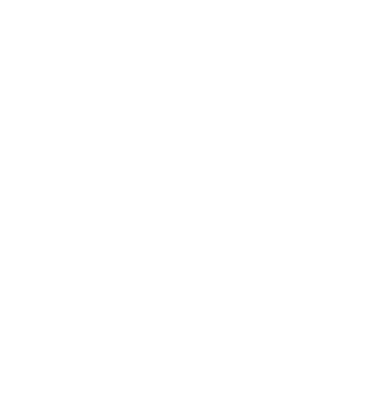

<!--
*** Thanks for checking out the Best-README-Template. If you have a suggestion
*** that would make this better, please fork the repo and create a pull request
*** or simply open an issue with the tag "enhancement".
*** Thanks again! Now go create something AMAZING! :D
*** README TEMPLATE MADE BY https://github.com/othneildrew/Best-README-Template
-->

<!-- PROJECT LOGO -->
 

  

  <h3 align="center">VoidToInfinite Project Portfolio</h3>
  

    Every person is infinte 🤩
     
    <a href="https://github.com/VoidToInfinite"><strong>Explore other projects »</strong></a>
     
     
  

<!-- TABLE OF CONTENTS -->

  
Table of Contents

  <ol>
    <li>
      <a href="#about-the-project">About The Project</a>
      <ul>
        <li><a href="#built-with">Built With</a></li>
      </ul>
    </li>
  </ol>

<!-- ABOUT THE PROJECT -->
## About The Project

  [![Product Name Screen Shot][product-screenshot]](https://github.com/VoidToInfinite/voidtoinfinite.github.io/blob/main/images/logo.svg)

We're a team with members in different types of fields with the idea of growing together by sharing knowledge and creating projects.

### Built With

This section should list any major frameworks that you built your project using. Leave any add-ons/plugins for the acknowledgements section. Here are a few examples.
* [NextJS](https://nextjs.org)
* [React](https://create-react-app.dev)

<!-- MARKDOWN LINKS & IMAGES -->
[product-screenshot]: images/logo.svg
